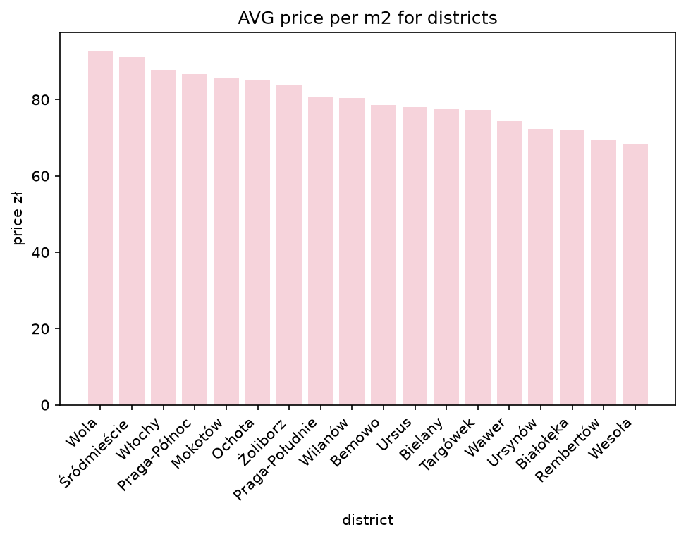
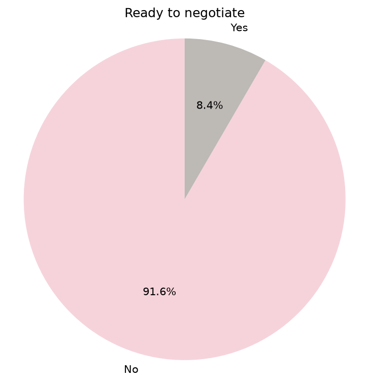
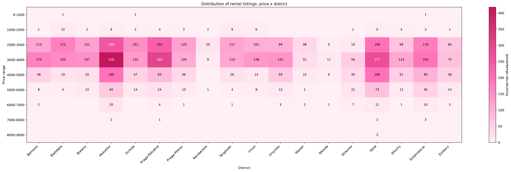
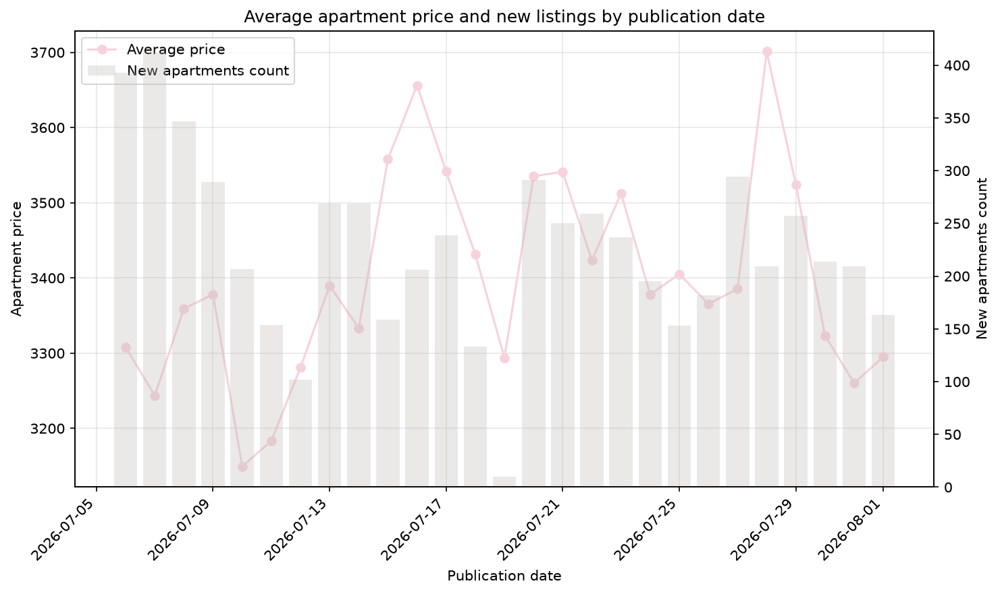
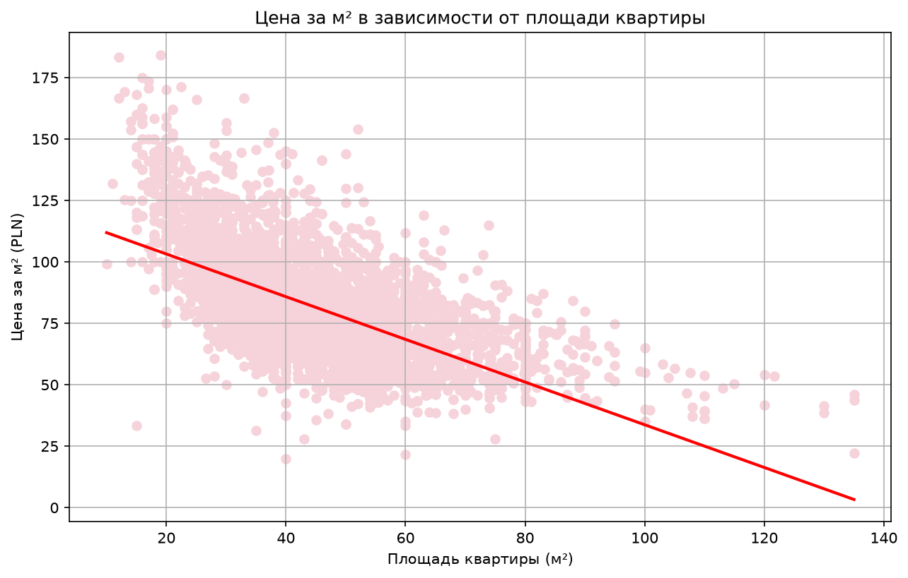

<h1 align="center">
Apartment Rental ETL Pipeline
</h1>

<p align="center">
ETL pipeline for collecting, processing and analyzing apartment rental listings from OLX
</p>


---

# Table of Contents

- [Overview](#overview)
- [Tech Stack](#tech-stack)
- [Architecture](#architecture)
- [Workflow](#workflow)
- [Project Structure](#project-structure)
- [Database Layers](#database-layers)
- [Installing](#installing)
- [Running the Project](#running-the-project)
- [Example Output](#example-output)
- [Future Improvements](#future-improvements)
- [Author](#author)

---

# Overview

This project implements an end-to-end ETL pipeline for collecting and analyzing apartment rental listings from OLX.

The pipeline automatically extracts raw listing data using Requests and BeautifulSoup, processes and cleans the data, stores it in a layered PostgreSQL data warehouse, and creates analytical tables for market analysis.

The workflow is orchestrated using Apache Airflow DAGs, providing automated and scheduled execution of the ETL process.

The project demonstrates practical Data Engineering skills, including:

- Web Scraping
- ETL Pipeline Development
- Data Cleaning and Transformation
- SQL and PostgreSQL
- Data Warehouse Architecture (Raw / Silver / Gold layers)
- Workflow Orchestration with Apache Airflow
- Containerization with Docker
- Data Visualization

---

# Tech Stack

| Category        | Technologies                             |
|-----------------|------------------------------------------|
| Language        | Python                                   |
| Database        | PostgreSQL                               |
| Orchestration   | Apache Airflow                           |
| Containers      | Docker                                   |
| Scraping        | BeautifulSoup and Requests               |
| Visualization   | Matplotlib                               |
| Version Control | Git & GitHub                             |
| CI/CD           | GitHub Actions (pre-commit checks on pr) |
---


#  Architecture

```text
    OLX
     │
     ▼
Requests + BeautifulSoup
     │
     ▼
PostgreSQL raw layer
     │
     ▼
Python Transformation
     │
     ▼
PostgreSQL silver layer
     │
     ▼
SQL Aggregation
     │
     ▼
PostgreSQL gold layer
     │
     ▼
Matplotlib Analytics
```

---

#  Workflow

```text
DAG: olx_apartments_etl (daily, 00:10 UTC)

1. create_tables            — ensure raw & silver tables exist

2. load_raw_data             — scrape OLX, insert into raw layer

3. transform_raw_to_silver   — clean & normalize raw → silver

4. refresh_gold_daily_market_stats — aggregate silver → gold

5. build_gold_plots  — generate analytics charts
     │
     ├─ price_per_m2_and_area_plot
     ├─ negotiate_pie_chart
     ├─ avg_price_per_m2_district_bar_chart
     ├─ district_price_heatmap
     └─ daily_average_price_chart
```

---

# Project Structure

```text
│
├── .github/
│    └── workflows/
│        └── check-pre-commit-hooks.yml
│
├── airflow/
│   ├── config/
│   ├── dags/
│   │   └── olx_apartment_pipeline.py
│   │
│   ├── logs/
│   ├── plugins/
│   └── docker-compose.yaml
│
├── src/
│   ├── raw/
│   │   └── extract.py
│   │
│   ├── silver/
│   │   └── transform.py
│   │
│   ├── gold/
│   │   └── plots.py
│   │
│   ├── source_queries/
│   │   ├── raw/
│   │   ├── silver/
│   │   └── gold/
│   │
│   └── utils/
│       ├── database_functions.py
│       └── parsing_utils.py
│
├── requirements.txt
└── README.md
```

---

# Database Layers

## Raw

Table: `raw_apartments`

Stores original scraped OLX data before transformation

| Column            | Description                                            | Data Types          |
|-------------------|--------------------------------------------------------|---------------------|
| id                | Unique identifier of the apartment listing             | INTEGER PRIMARY KEY |
| district_and_date | Raw location and publication date field                | VARCHAR             |
| price             | Raw apartment price                                    | VARCHAR             |
| area              | Raw apartment area                                     | VARCHAR             |
| ingestion_date    | Date and time when data was ingested into the pipeline | DATE                |
| link              | URL of the original apartment listing                  | TEXT                |
---

## Silver

Table: `silver_apartments`

Contains cleaned and standardized apartment information

| Column              | Description                                | Data Types          |
|---------------------|--------------------------------------------|---------------------|
| id                  | Unique identifier of the apartment listing | INTEGER PRIMARY KEY |
| district            | Apartment district                         | VARCHAR             |
| date                | Publication date                           | VARCHAR             |
| price_zl            | Apartment rental price in PLN              | NUMERIC             |
| area_m2             | Area in square meters                      | NUMERIC             |
| ready_to_negotiate  | Boolean flag                               | BOOLEAN             |
| link                | URL of the original apartment listing      | TEXT                |

---

## Gold
Tables:

- `gold_daily_market_statistics`

Contains business metrics used for analysis.

Business-ready aggregated statistics.

Examples:

- Average apartment price
- Average price per m²
- Number of listings
- Daily market statistics

---

# Installing

1. Clone repository

```bash
git clone https://github.com/katletka123/-ApartmentRentalAirflow
```

2. Install dependencies

```bash
pip install -r requirements.txt
```

3. Create `.env`

Example .env values:
```env
DB_HOST = localhost
DB_PORT = 5432
DB_NAME = my_db
DB_USER = postgres
DB_PASSWORD = password

COMPOSE_PROJECT_NAME=airflow
FERNET_KEY = generate using the command below
AIRFLOW_UID = generate using the command below
```
FERENT_KEY:
```bash
docker run --rm python:3.11-slim bash -c "pip install cryptography -q && python -c \"from cryptography.fernet import Fernet; print(Fernet.generate_key().decode())\""
```
AIRFLOW_UID:
```bash
echo $(id -u)
```


# Running the Project

Run ETL

1. Start all services (Airflow, PostgreSQL)
```bash
docker compose up -d --build
```
2. Log in (default credentials: airflow / airflow, unless changed in docker-compose.yaml)
3. Enable and trigger the olx_apartments_etl DAG

The DAG will run automatically on schedule (daily at 00:10), or you can trigger it manually from the UI for an immediate run

---

# Example Output

The pipeline generates the following analytics charts:

### Average Price per m² by District


### Negotiable vs Fixed Price Listings


### District Price Heatmap


### Daily Average Price Trend


### Average Price Trend

---

# Future Improvements

1. Unit tests for extraction, transformation, and loading logic
2. Cloud deployment (e.g. AWS/GCP-hosted Airflow and PostgreSQL)
3. Interactive dashboard (e.g. Streamlit or Grafana)
4. Data quality monitoring and alerting

---

# Author

**Anastasiya Kazlova**
